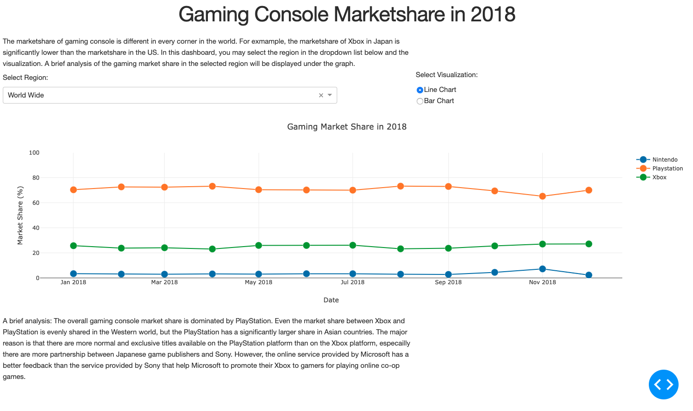

# Dashboard Example - Gaming Console Market Share in 2018
The goal of this example is to use Plotly Dash to build a dashboard to display the gaming console market share in 2018 using the techniques learnt in Part 1,2,3. 

## Background and Dashboard Design
Fun fact: PlayStation sells way better in Asian market than the sales of Xbox. I want to develop a dashboard for users to display the gaming console market share in different region with a brief analysis. 
 
In this dashboard, I would like to have the users first to select region and the dashboard would update the visualization based on what region the users selected and display the brief analysis below the visualization.
 
Therefore, the layout of this dashboard would be including a headline, background and description, region and visualization selections, visualization, and analysis.

## Files
There is 1 python file, [DashExample](DashExample.py) and a folder of data, "Data Folder", including data set files in csv files and text files of market share analysis.
 
 
In the python file, it defines how the dashboard is running. It consists 3 parts:
* Read files and definition
* Dashboard layout
* Dashboard interaction
 
In first part of the code, the program read all the data set in csv files in the Data Folder, define the options of the dropdown list and radio item list, headline, background and description.
 
The second part is the core part of the program, the dashboard layout. In the layout, there are 5 components on the Dashboard:
* H1, to display headline.
* Div, to display background and description of the dashboard.
* Div, which consists two Div's, each sub-Div is built to store dropdown list and radio item list. The dropdown list is built to select region, and the radio item list is built to select whether the user wants to display in line chart or bar chart.
* Div, which consists a dcc.Graph() object with a id='vis' which render a Plotly visualization
* Div, which consists a dcc.Markdown() to display the brief analysis
 
The third part is defining the dashboard interaction. It consists of 3 functions:
* display_graph()
* getLineChart()
* getBarChart()
 
If the users have change the selection on the dropdown list or radio item list, display_graph() is called and return a new visualization. There are two parameters will be received when the function is called: the value of the dropdown list and the value of the radio item list, the values represent the region selection and the type of visualization selection, respectively. When the function is called, it would filter the data to the region selected and plot the visualization by calling either getLineChart() or getBarChart() whether either type of visualization is selected. The next step is to obtain the analysis by reading the analysis saved in the text file in the Data folder. Once the visualization and analysis are prepared, the function will return both objects to app.layout(). The visualization will be plotted on the div with id='vis', and the analysis will be display on the dcc.MarkDown().

## Result
The dashboard looks like this: 

## Source
The below hyperlinks are the source of the data set: 
* http://gs.statcounter.com/os-market-share/console/hong-kong/2018
* https://gs.statcounter.com/os-market-share/console/united-states-of-america/2018
* https://gs.statcounter.com/os-market-share/console/united-kingdom/2018
* https://gs.statcounter.com/os-market-share/console/canada/2018
* https://gs.statcounter.com/os-market-share/console/japan/2018
https://gs.statcounter.com/os-market-share/console/south-korea/2018