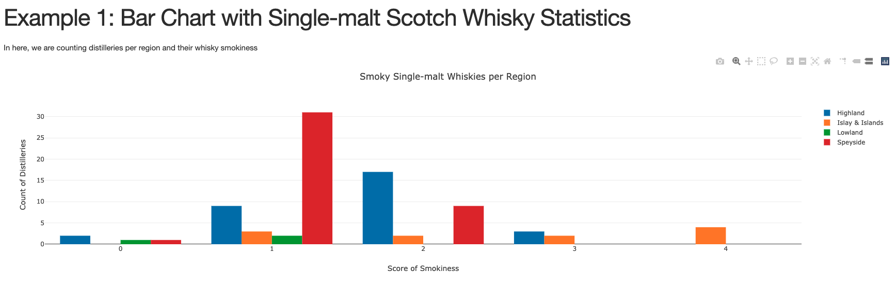
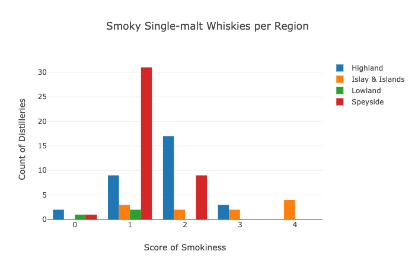
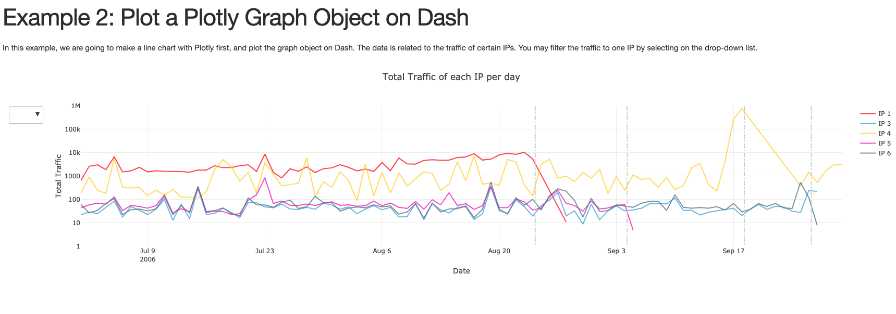

# Basics of Using Dash

## Prequisite of using Dash
<ul>
	<li> Knowing how Plotly works in Python</li>
	<li> Knowing how Flask works in Python</li>
	<li> Understand how html works</li>
</ul>

## Plotly Dash Example
Reference here: <a href="https://dash.plotly.com/layout">Dash Layout</a>
 
 
app.py is the code copied from the plotly dash site for testing.
 
 
Dash is very similar to using Flask on building a html. In this example, app.layout to outline the html page and build the Plotly figure in here. This is a higher level method to build bar chart on Dash.

## Practice on my own
I used whisky.csv to plot a bar chart. You may find the data <a href="https://github.com/jacquessham/ScotchWhisky/tree/master/Data">here</a>. And the result looks like this:
 

 
 
And the original Plotly graph looks like:

## Using go.Figure on Dash
Reference here: <a href="https://dash.plotly.com/dash-core-components/graph">Dash Layout</a>
  
If you know how to make a graph on Plotly and wish to host it on Dash. You may also do this. In this example, I will use my existing Plotly graph and host it on Dash. The Plotly line chart is about the traffic of IPs given in the data set and was a homework I worked on my Data Visualization class in graduate school.
  
The result looks like this:
