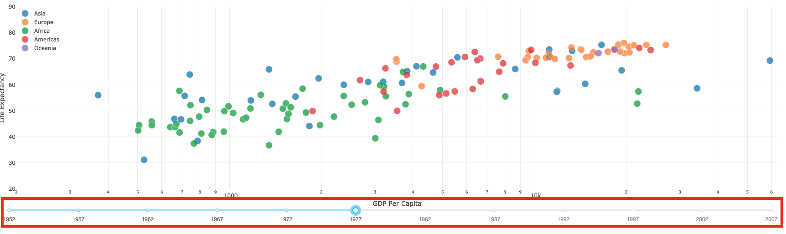
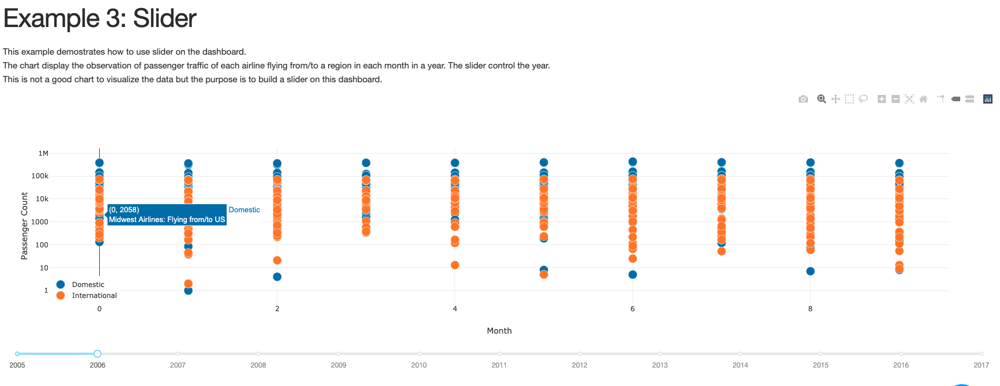
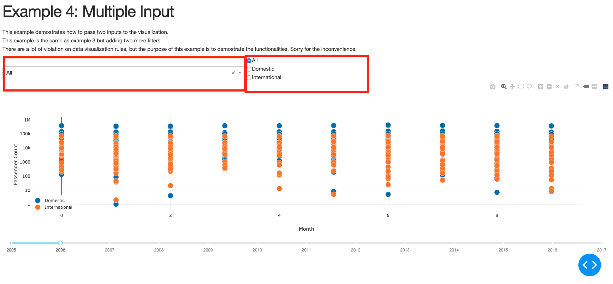
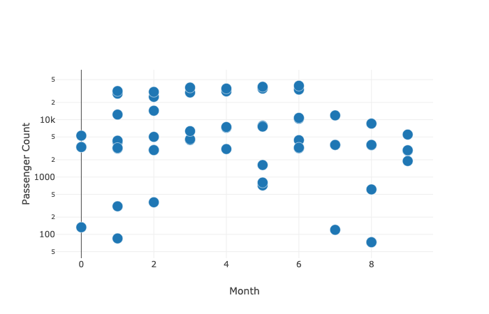
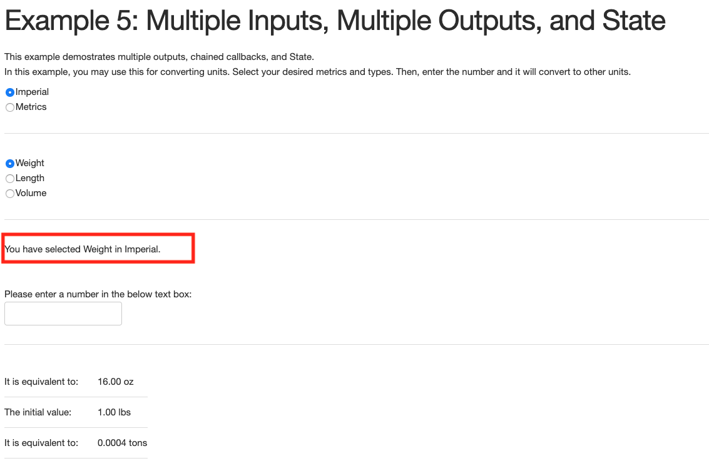
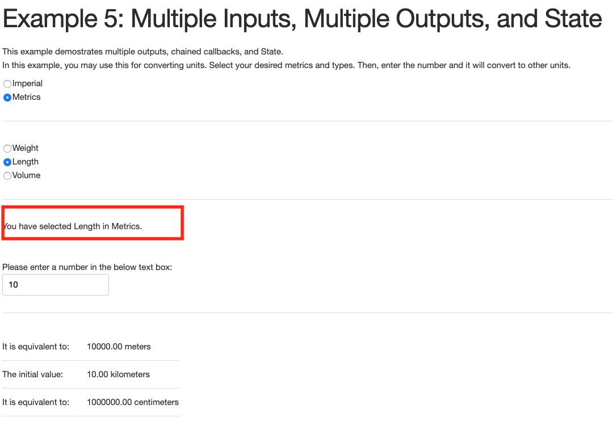

# Part 2: Dash Callbacks

## Last Chapter
Click [here](../Part1) to go back to the last chapter. 

## Goals
In this chapter, we are going over callbacks in Dash, allowing user to filter or select data to update the visualization. The goals of Part 2
 
1. Use slider to filter data  
2. Use textbox for inputing data 
3. Use dropdown list to filter data 
4. Use radio items to filter data 
5. Use Input() and Output() to update the visualizations. 
6. Understand how to pass multiple inputs 
7. Generate more than 1 output  
8. Provide the state of what user has selected
  
You may find the reference [here](https://dash.plotly.com/basic-callbacks)

## Input() and Output()
Under dash.dependencies, import Input() and Output() in order to update the visualization on Dash.  
Before using these functions, you have to make sure you have to assign the id's in components you wish to be receiving the input or generating onto.  
Like Flask, you have to add "@app.callback()" above the functions, then, you will put Output()'s and Input()'s to locate the components on the html page. 

## Example 3: Slider
There are two steps to add slider on your html page. First, add dcc.Slider() in app.layout. Second, add a function to define how the slider re-generate the visualization.  
Following the [code](dash_slider.py) from the Dash tutorial, the result looks like this:

    
The file [example3_slider.py](example3_slider.py) is the file built for my practice. The data is the passenger traffic of San Francisco International Airport from [DataSF](https://datasf.org/opendata/). The dashboard is aimed to displaythe passenger traffic of each airline and destination at a given year. The dashboard contains a scatterplot with x-axis of month and y-axis of passenger traffic count using a slider to select the year. Although the visualization violates a lot of principles of data visualization, the purpose of this dashboard is to demostrate how to use a slider to filter the data set.   
The result looks like this:

  
If you want to display the scatter points in different colour based on the third demension, you may pass a list of dictionary of data points in figure. In dash_slider.py, you may find the list <b>traces</b> to include data from different continent.

## Example 4: Multiple Inputs
There are 2 steps to add one input to re-generate the visualization. First, add a dropbox/radio items or any input media in an added html component in layout, then list the selection in dropbox/radio items. Afterward, define how the input would re-generate the new visualization.
  
Since there are more than 1 input, you have to wrap all Input() in a list in app.callback(). Then, you would manipulate the data according to the user's wish in the function and pass the data to figure.
  
The example visualization is the same as the visualization in Example 3, except there is one dropbox list and one radio items list for user to filter the data set. 
 
You may find the code [here](example4_multinput.py)
 
The layout looks like this:

 
The red-boxed areas are the dropdown-list and radio items. Those are the input options to filter the data in order to re-generate the graph below.
  
If I select "Terminal 1" in the drop-down and "International" radio button, the graph would be updated to:

 
If only "International" in the drop-down and "All" radio button, the graph would be updated to:

## Example 5: Multiple Inputs, Multiple Outputs and State
The way of making Multiple Outputs is similar to making Multiple Inputs. Once you have the html components ready for the outputs, all you have to do is to place the multiple Output() in a list in app.callback() and manipulate the data you want to display.
  
State display what the user has selected or entered. In the code, you only have to gather the input data and display on one of the html components (Or do other command other than displaying).
  
In this example, the dashboard is aimed to let user to enter a number and convert to other units in the same metric system, if I select weight in Imperial metric and enter 1 lb, the dashboard would display 16 oz or 0.0004 ton on a html table. 
 
You may find the code [here](example5_multioutputs.py)
 
The dashboard allow user to choose weight, length, or volume in Imperial Metrics or Metrics. The default page looks like this:

The red-boxed area display the state of the default selection.
  
If I select length in Metrics and enter 10 in the text box, the dashboard would convert it to meters and centimeters on the table, like this:

The red-boxed area display the state which I have selected "Length" and "Metrics".

## Example 6: Markdown
Markdown is available in Dash.
 
Using Markdown is easy. First, add a html Component in app.layout() and pass the string into dcc.Markdown().

## Notes
<ul>
	<li>Never have duplicated id's. Follow the rules of naming id's in html.</li>
	<li>The key and value of tuple in Output/Input is: (id, property)</li>
	<li>In @app.callback(), use list to include more than 1 Input() or Output()</li>
	<li>Input from one ID could only used in one function.</li>
	<li>You may pass string or F string to Markdown.</li>
</ul>

## Next Charter
Clicker [here](../Part3) to advance to next chapter.