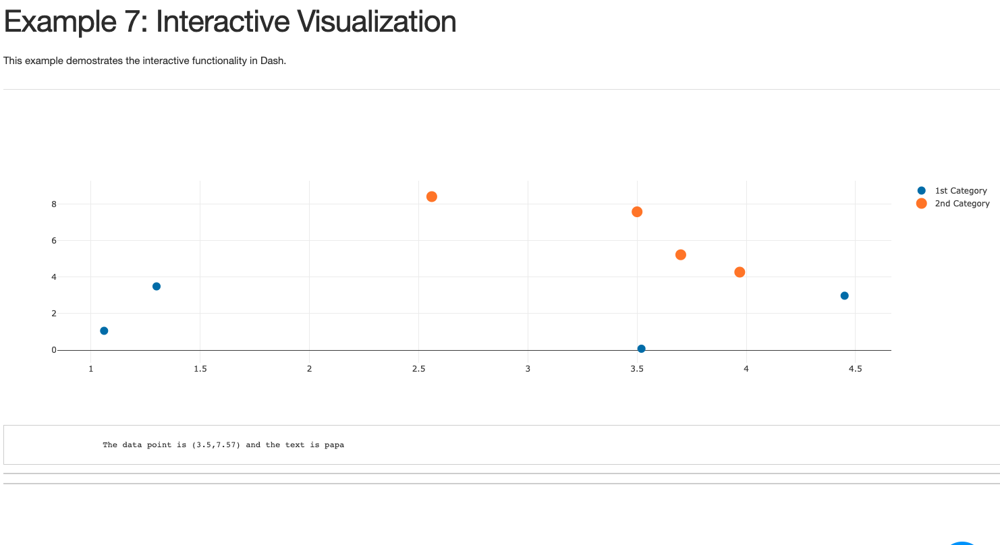
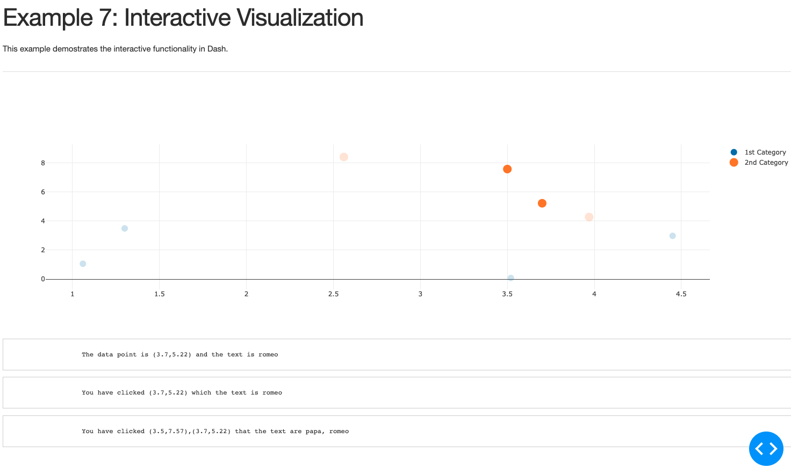

# Part 3: Interactive Visualization

## Last Chapter
Click [here](../Part2) to go back to the last chapter.

## Goals
In this chapter, we are going over interactive graphing in Dash. The goals of Part 3 are: 
1. Display detail data when hovering data point on the graph. 
2. Display detail data when selecting one data point on the graph. 
3. Display detail data when selecting multiple points on the graph. 
  
You may find the reference [here](https://dash.plotly.com/interactive-graphing)

## Example 7: Interactive Visualization
Displaying detail data when hovering or selecting data point on the graph is similar to selecting on slider or dropdown list. As usual, the first step is to set up the html component to display the detail of the of hovered or selected data. Then, set up the function to update as usual. However, under input, instead of obtaining 'value' from the component property, pass 'hoverData' for Hovering, 'clickData' for selecting one data point, or 'selectedData' for selecting multiple data points in Input.  
The example randomly plotly 8 data points on the Scatter plot and allow user to hover or select data point if the user wishes to learn more about it. Once the data point is hovered or selected, the detail would be displayed below the Scatter plot: The first Pre displays hovering data, the second Pre displays selected data (One data point only. Every click override the selection.), the third Pre displays selected data points (It looks similar to the second Pre if only one data point selected. If more than 1 data point selected, all data point detail would be displayed). If the user wishes to select more than one point. Press "Shift" when selecting more than 1 data point. If selecting data point without pressing "Shift", the selection would be overrided.   
The code example may be found [here](example7_interactive.py)
  
The dashboard looks like this when the user hovers over a data point:

  
If more than one data point is selected, the dashboard looks like this:
