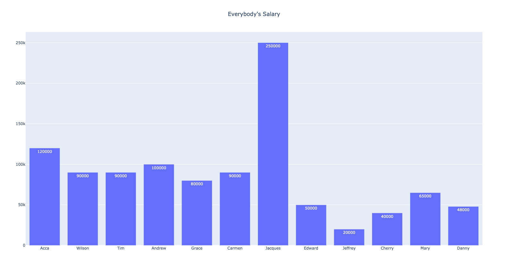
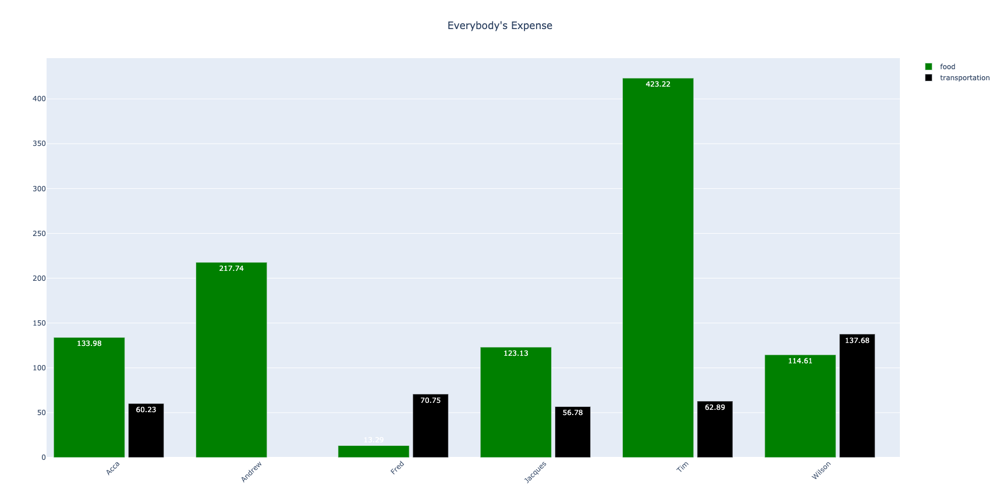

# Bar Charts
In this folder, we will go over how to create bar charts with Python and Plotly.

## Files
The following scripts are used in this chapter:
<ul>
	<li>Simplebar.py</li>
	<li>Groupbar.py</li>
	<li>Stackbar.py</li>
</ul>

## Pacakges Needed
This chapter requires the following packages for the scripts used:
<ul>
	<li>Pandas</li>
	<li>Plotly</li>
</ul>

## Data Used
This chapter may use the following data from the [Data folder](../Data):
<ul>
	<li><i>salary.csv</i></li>
	<li><i>expense.csv</i></li>
</ul>

## Syntax
Coming Soon...

## Examples
### Example 1 - Simple Bar Chart

Coming Soon...

### Example 2 - Grouped Bar Chart

Coming Soon...

### Example 3 - Stacked Bar Chart

Coming Soon...